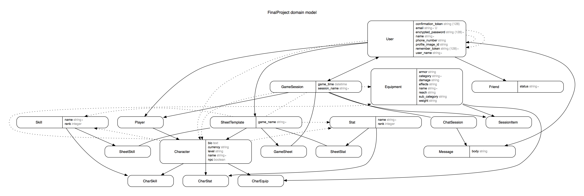
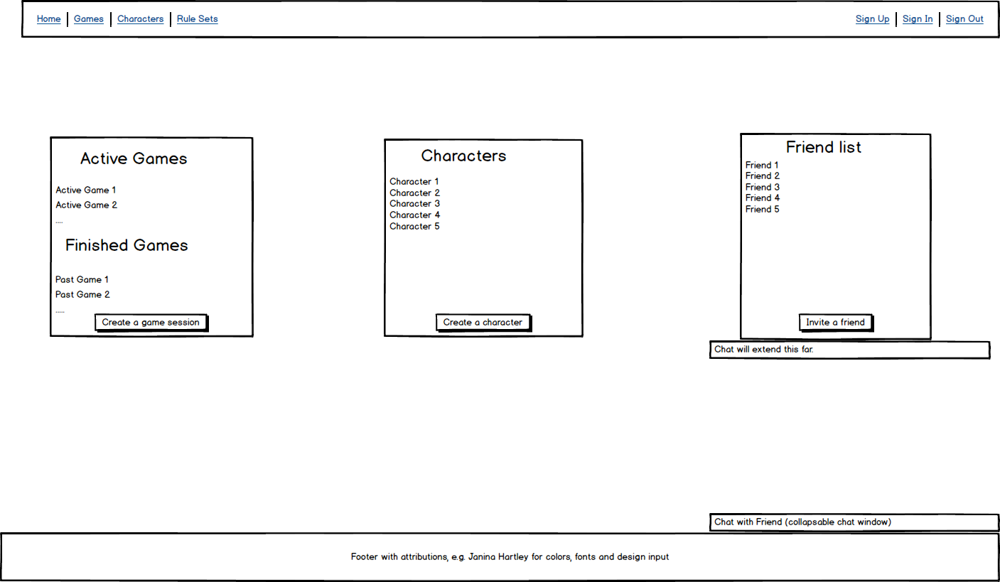
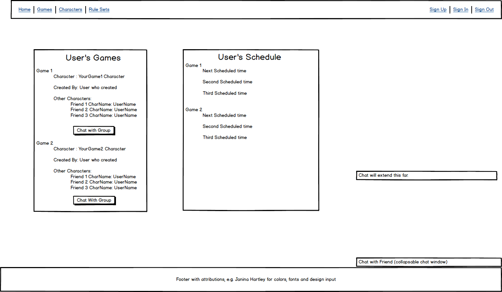

# Role Together
Visit [Role Together](www.roletogether.com) to see a live version of the site.

Feel free to reach out to me with questions or suggestions at my [email](mailto:carmichaeldane@gmail.com)

## Description
Role Together is intended to serve as a way to play pen and paper role-playing games online or locally. Role Together lets users create game sessions and invite any user of the website to their game. Each game has a character sheet template that will shape how each character is created. Users can use sheets that any user has already made or create their own to ensure their game session fits their play style. There is a chat room built into each session that allows the players to chat amongst themselves and roll dice.

## Libraries and Technologies
* Ruby 2.3
* Rails 4.2
* React-rails 1.7.0
* [Clearance](https://github.com/thoughtbot/clearance) for authentication.
* [Chronic](https://github.com/mojombo/chronic) for natural language time object creation.
* [Materialize](http://materializecss.com/) for a responsive front-end framework based on Material Design.
* [gravatarify](https://github.com/lwe/gravatarify) for user avatars.

## UML and Wireframes

